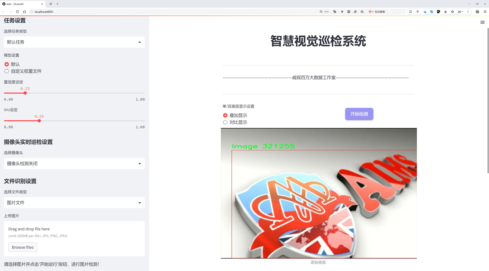
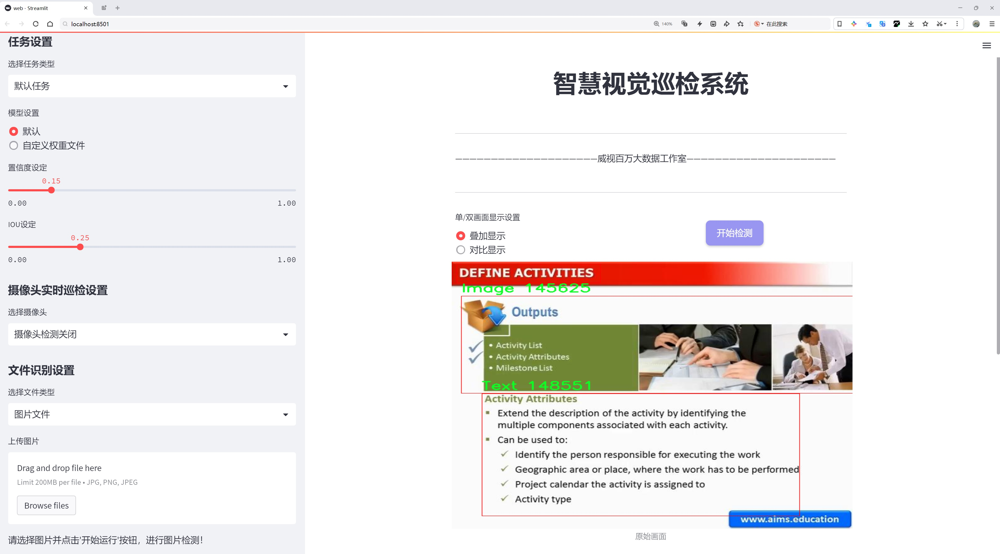
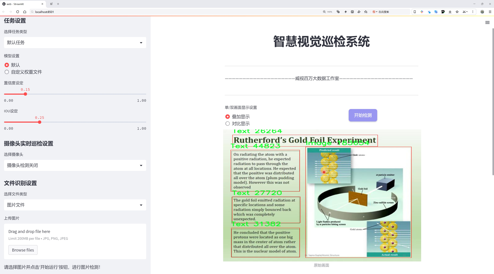
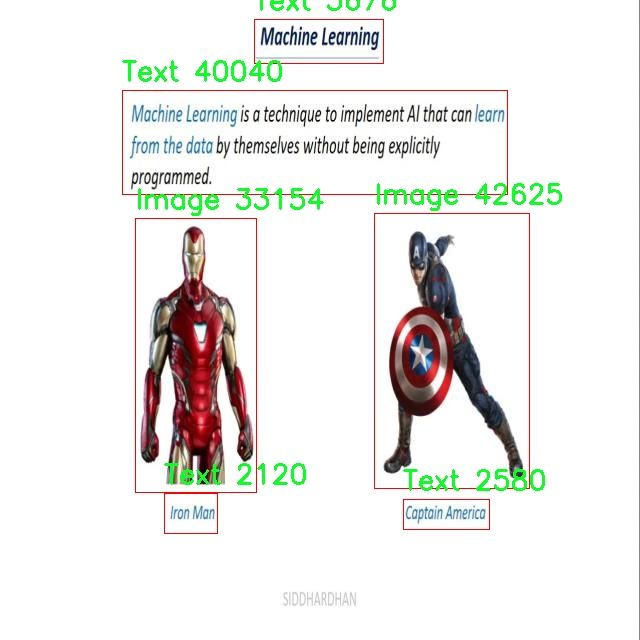
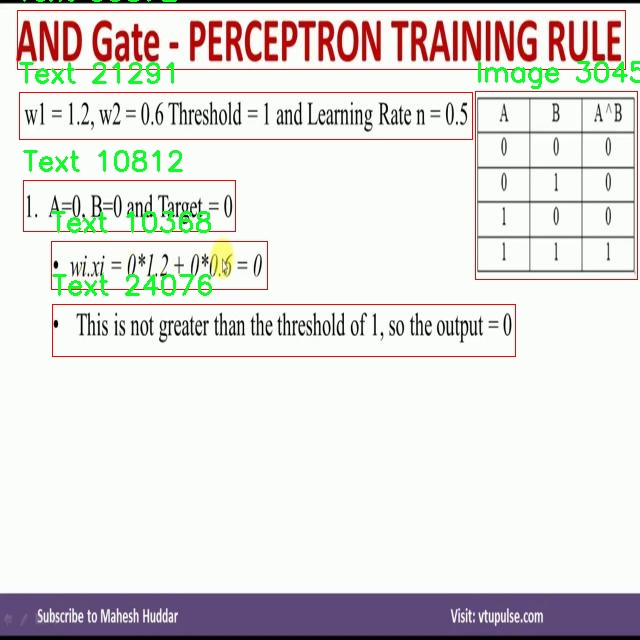
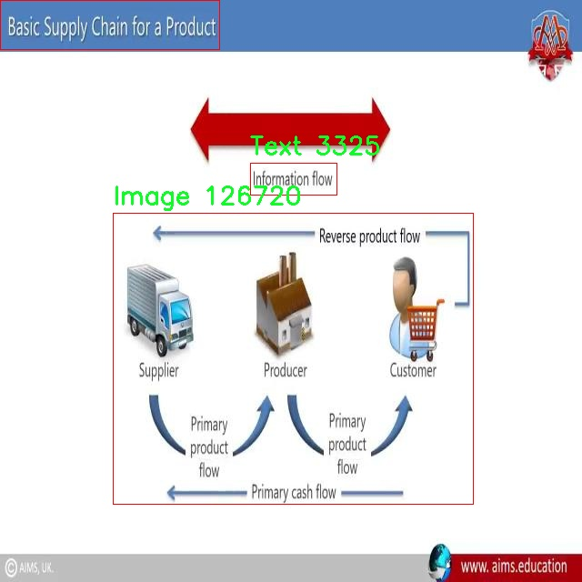
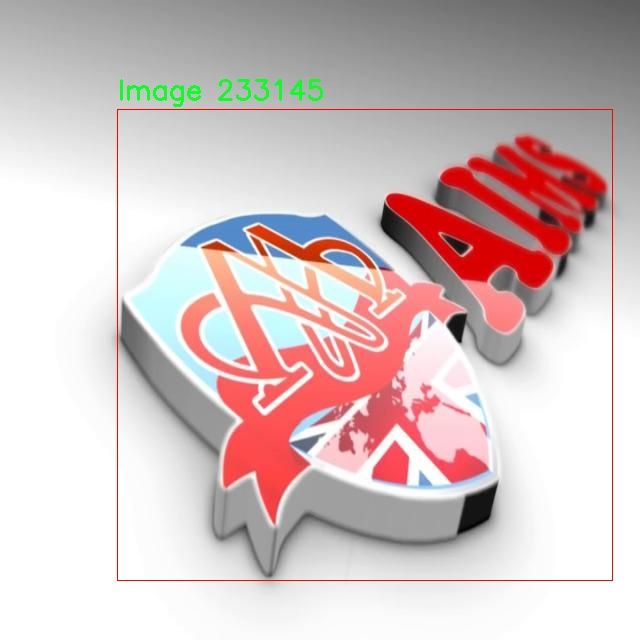
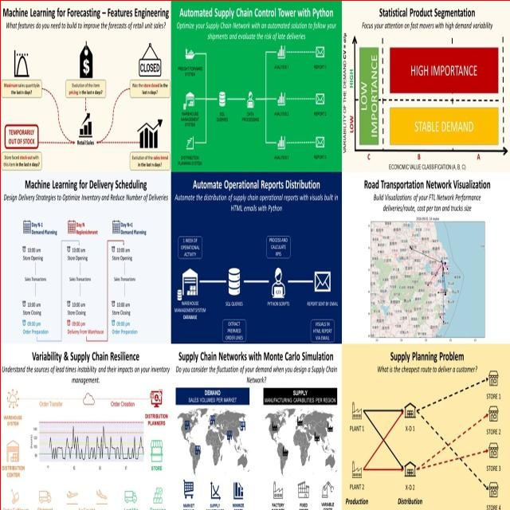

# PPT布局图片文本解析检测系统源码分享
 # [一条龙教学YOLOV8标注好的数据集一键训练_70+全套改进创新点发刊_Web前端展示]

### 1.研究背景与意义

项目参考[AAAI Association for the Advancement of Artificial Intelligence](https://gitee.com/qunmasj/projects)

研究背景与意义

随着信息技术的迅猛发展，电子文档的使用日益普及，尤其是PPT（PowerPoint）作为一种广泛应用于学术、商业及教育领域的演示工具，其重要性愈发凸显。然而，传统的PPT制作往往依赖于人工操作，效率低下且容易产生错误。因此，如何自动化地解析和优化PPT布局，成为了当前研究的一个重要方向。基于此背景，本文提出了一种改进的YOLOv8模型，旨在构建一个高效的PPT布局图片文本解析系统，以提升PPT制作的智能化水平。

在现有的研究中，YOLO（You Only Look Once）系列模型因其出色的实时目标检测能力而备受关注。YOLOv8作为该系列的最新版本，具有更高的准确性和更快的处理速度，能够在复杂场景中有效识别和定位目标。针对PPT布局中的图片和文本元素，本文将利用YOLOv8的强大特性，通过改进算法来提高对不同布局形式的适应性和解析精度。数据集方面，我们使用了包含3055张图像的专用数据集，涵盖了两类目标：图片和文本。这一数据集的构建为模型的训练和验证提供了坚实的基础，确保了系统在实际应用中的有效性。

PPT布局解析的意义不仅体现在技术层面，更在于其对提升工作效率和信息传递质量的深远影响。通过自动化解析PPT中的图片和文本，用户可以快速获取关键信息，减少手动操作的时间成本。此外，系统的应用能够帮助用户更好地理解和利用信息，提升演示效果。尤其在教育和培训领域，教师和学生可以通过这一系统更高效地制作和分享学习材料，从而促进知识的传播与交流。

此外，随着大数据和人工智能技术的不断发展，PPT布局解析系统的研究也为相关领域的创新提供了新的思路。例如，在智能教育、在线会议和虚拟演示等场景中，基于改进YOLOv8的解析系统能够实现实时反馈和智能推荐，进一步提升用户体验。未来，随着技术的不断进步，该系统还可以与其他智能工具结合，形成更为全面的智能办公解决方案。

综上所述，基于改进YOLOv8的PPT布局图片文本解析系统的研究，不仅具有重要的学术价值，更具备广泛的应用前景。通过深入探讨和实践该系统的构建与优化，能够为PPT制作的智能化发展提供有力支持，推动信息技术在教育、商业等领域的进一步应用与创新。

### 2.图片演示







##### 注意：由于此博客编辑较早，上面“2.图片演示”和“3.视频演示”展示的系统图片或者视频可能为老版本，新版本在老版本的基础上升级如下：（实际效果以升级的新版本为准）

  （1）适配了YOLOV8的“目标检测”模型和“实例分割”模型，通过加载相应的权重（.pt）文件即可自适应加载模型。

  （2）支持“图片识别”、“视频识别”、“摄像头实时识别”三种识别模式。

  （3）支持“图片识别”、“视频识别”、“摄像头实时识别”三种识别结果保存导出，解决手动导出（容易卡顿出现爆内存）存在的问题，识别完自动保存结果并导出到。

  （4）支持Web前端系统中的标题、背景图等自定义修改，后面提供修改教程。

  另外本项目提供训练的数据集和训练教程,暂不提供权重文件（best.pt）,需要您按照教程进行训练后实现图片演示和Web前端界面演示的效果。

### 3.视频演示

[3.1 视频演示](https://www.bilibili.com/video/BV1VKsLeHEpv/?vd_source=ff015de2d29cbe2a9cdbfa7064407a08)

### 4.数据集信息展示

数据集信息展示

本数据集名为“视频到PPT”，旨在为改进YOLOv8的PPT布局图片文本解析系统提供必要的训练素材。该数据集包含3055张图像，涵盖了两个主要类别：图像和文本。这一分类设计的初衷在于帮助模型更好地理解和解析PPT中的视觉元素与文本信息，从而提升其在实际应用中的表现。

在现代信息传播中，PPT作为一种广泛使用的演示工具，承载着大量的视觉和文本信息。随着数字化进程的加快，如何高效地从视频中提取出这些信息并进行有效的整理与展示，成为了一个重要的研究课题。数据集中的3055张图像，均为从视频中提取而来，经过精心挑选和标注，确保其在多样性和代表性方面具有良好的覆盖。这些图像不仅包含了丰富的文本内容，还展示了多种布局形式，反映了不同类型PPT的设计风格和信息组织方式。

在数据集的构建过程中，特别注重了图像和文本的清晰度与可读性。每一张图像都经过了专业的标注，确保模型在训练时能够准确识别和区分图像与文本两类信息。这种精细化的标注方式，旨在提高YOLOv8在处理复杂PPT布局时的准确性和鲁棒性，使其能够在实际应用中更好地满足用户需求。

数据集的使用遵循CC BY 4.0许可证，这意味着用户可以自由地使用、修改和分发该数据集，只需适当归属原作者。这一开放的许可证设计，鼓励更多的研究者和开发者参与到相关技术的探索与创新中来，推动图像处理和文本解析领域的进步。

在实际应用中，经过YOLOv8训练后的模型将能够高效地从视频中提取出PPT的关键元素，自动识别并分类图像与文本，进而生成结构化的PPT内容。这一过程不仅提高了信息提取的效率，也为用户节省了大量的时间和精力，尤其是在处理大量视频资料时，能够显著提升工作效率。

综上所述，“视频到PPT”数据集为改进YOLOv8的PPT布局图片文本解析系统提供了坚实的基础。通过对3055张图像的深度学习与训练，期望能够实现更高效、更智能的PPT信息解析，推动相关技术的发展与应用，为教育、商业演示等多个领域带来便利。随着技术的不断进步和数据集的持续优化，未来的PPT解析系统将更加智能化，能够更好地服务于用户的需求。











### 5.全套项目环境部署视频教程（零基础手把手教学）

[5.1 环境部署教程链接（零基础手把手教学）](https://www.ixigua.com/7404473917358506534?logTag=c807d0cbc21c0ef59de5)


[5.2 安装Python虚拟环境创建和依赖库安装视频教程链接（零基础手把手教学）](https://www.ixigua.com/7404474678003106304?logTag=1f1041108cd1f708b01a)

### 6.手把手YOLOV8训练视频教程（零基础小白有手就能学会）

[6.1 环境部署教程链接（零基础手把手教学）](https://www.ixigua.com/7404477157818401292?logTag=d31a2dfd1983c9668658)

### 7.70+种全套YOLOV8创新点代码加载调参视频教程（一键加载写好的改进模型的配置文件）

[7.1 环境部署教程链接（零基础手把手教学）](https://www.ixigua.com/7404478314661806627?logTag=29066f8288e3f4eea3a4)

### 8.70+种全套YOLOV8创新点原理讲解（非科班也可以轻松写刊发刊，V10版本正在科研待更新）

由于篇幅限制，每个创新点的具体原理讲解就不一一展开，具体见下列网址中的创新点对应子项目的技术原理博客网址【Blog】：


[8.1 70+种全套YOLOV8创新点原理讲解链接](https://gitee.com/qunmasj/good)

### 9.系统功能展示（检测对象为举例，实际内容以本项目数据集为准）

图1.系统支持检测结果表格显示

  图2.系统支持置信度和IOU阈值手动调节

  图3.系统支持自定义加载权重文件best.pt(需要你通过步骤5中训练获得)

  图4.系统支持摄像头实时识别

  图5.系统支持图片识别

  图6.系统支持视频识别

  图7.系统支持识别结果文件自动保存

  图8.系统支持Excel导出检测结果数据


### 10.原始YOLOV8算法原理

原始YOLOv8算法原理

YOLOv8作为YOLO系列的最新成员，承载着前辈们的创新成果，并在此基础上进行了多项重要改进。其核心架构依然由输入层、主干网络、特征融合层和解耦头构成，但在每个模块中都融入了新的设计理念和技术，使得YOLOv8在目标检测领域中展现出更高的精度和效率。

在主干网络方面，YOLOv8延续了YOLOv5的CSPDarknet思想，采用了C2f模块来替代YOLOv5中的C3模块。C2f模块的设计灵感来源于YOLOv7的ELAN结构，旨在通过引入更多的shortcut连接来缓解深层网络中的梯度消失问题。这种结构不仅提高了特征的重用性，还增强了网络对细节信息的捕捉能力。C2f模块由多个CBS（卷积+归一化+SiLU激活）模块和若干Bottleneck组成，通过分支结构实现特征的并行处理与融合，确保了在特征提取过程中信息的丰富性和多样性。

YOLOv8在特征融合层采用了PAN-FPN结构，旨在充分利用不同层次的特征信息。与YOLOv5相比，YOLOv8在上采样阶段去掉了1x1卷积，直接将高层特征上采样后与中层特征进行连接。这种设计使得高层特征的语义信息与中层特征的细节信息得以有效融合，从而提升了目标检测的准确性和鲁棒性。特征融合的过程中，YOLOv8还保持了不同尺度特征图的通道数一致，确保了在多尺度目标检测中的一致性和有效性。

在目标检测的核心思想上，YOLOv8摒弃了传统的Anchor-Base方法，转而采用Anchor-Free的策略。这一转变使得模型在处理目标时不再依赖于预设的锚框，而是通过自适应的方式进行目标定位。这种灵活性不仅提高了模型的适应性，还在一定程度上减少了计算复杂度。此外，YOLOv8引入了Task-Aligned的样本匹配策略，替代了静态匹配方法，从而进一步提升了训练效率和检测精度。

损失函数的设计是YOLOv8的另一大亮点。YOLOv8采用了VFLLoss作为分类损失，结合DFLLoss和CIoULoss来计算边界框的回归损失。这种多重损失函数的组合，使得模型在训练过程中能够更好地平衡分类和回归任务，进而提升了目标检测的整体性能。尤其是在处理小目标和样本不平衡问题时，YOLOv8展现出了更强的适应能力。

在数据预处理方面，YOLOv8沿用了YOLOv5的策略，采用了马赛克增强、混合增强、空间扰动和颜色扰动等多种数据增强手段，以提升模型的泛化能力。通过将输入图像转换为640x640的RGB图像，YOLOv8能够在训练过程中有效地增加样本的多样性，从而提高模型的鲁棒性。

YOLOv8的解耦头部分借鉴了YOLOX和YOLOv6的设计，取消了objectness分支，简化了模型结构。解耦头通过对不同尺度的特征图进行分类和回归的独立处理，进一步提升了模型的检测效率。输出的特征图经过Softmax和卷积计算后，能够准确地预测目标的类别和边界框位置。这种设计不仅提高了检测的精度，还有效降低了计算负担，使得YOLOv8在实时检测场景中表现出色。

综上所述，YOLOv8在目标检测领域中展现出了强大的能力，其在主干网络、特征融合、样本匹配、损失函数等多个方面的创新设计，使得该算法在精度和速度上都达到了新的高度。作为一款集成了众多先进思想的目标检测模型，YOLOv8无疑将为相关应用领域带来新的机遇和挑战。随着YOLOv8的不断发展和完善，未来在自动驾驶、智能监控、工业检测等领域的应用前景将更加广阔。


### 11.项目核心源码讲解（再也不用担心看不懂代码逻辑）

#### 11.1 ui.py

以下是经过简化和注释的核心代码部分：

```python
import sys
import subprocess
from QtFusion.path import abs_path

def run_script(script_path):
    """
    使用当前 Python 环境运行指定的脚本。

    Args:
        script_path (str): 要运行的脚本路径
    """
    # 获取当前 Python 解释器的路径
    python_path = sys.executable

    # 构建运行命令，使用 streamlit 运行指定的脚本
    command = f'"{python_path}" -m streamlit run "{script_path}"'

    # 执行命令并等待其完成
    result = subprocess.run(command, shell=True)
    
    # 检查命令执行结果，如果返回码不为0，则表示出错
    if result.returncode != 0:
        print("脚本运行出错。")

# 主程序入口
if __name__ == "__main__":
    # 获取脚本的绝对路径
    script_path = abs_path("web.py")

    # 运行指定的脚本
    run_script(script_path)
```

### 代码分析与注释：

1. **导入模块**：
   - `sys`：用于访问与 Python 解释器相关的变量和函数。
   - `subprocess`：用于执行外部命令。
   - `abs_path`：从 `QtFusion.path` 模块导入的函数，用于获取文件的绝对路径。

2. **`run_script` 函数**：
   - 该函数接受一个脚本路径作为参数，并使用当前 Python 环境运行该脚本。
   - `python_path = sys.executable`：获取当前 Python 解释器的路径，以便在命令中使用。
   - `command`：构建要执行的命令字符串，使用 `streamlit` 模块运行指定的脚本。
   - `subprocess.run(command, shell=True)`：执行构建的命令，并等待其完成。
   - `if result.returncode != 0`：检查命令的返回码，如果不为0，表示脚本运行出错。

3. **主程序入口**：
   - `if __name__ == "__main__":`：确保只有在直接运行该脚本时才会执行以下代码。
   - `script_path = abs_path("web.py")`：获取要运行的脚本 `web.py` 的绝对路径。
   - `run_script(script_path)`：调用 `run_script` 函数来运行指定的脚本。

这个文件是一个 Python 脚本，主要功能是运行一个名为 `web.py` 的脚本。它使用了 `subprocess` 模块来在当前的 Python 环境中执行指定的脚本。首先，脚本通过 `import` 语句引入了必要的模块，包括 `sys`、`os` 和 `subprocess`，以及一个自定义的 `abs_path` 函数，用于获取文件的绝对路径。

在 `run_script` 函数中，首先获取当前 Python 解释器的路径，接着构建一个命令字符串，这个命令用于运行 `streamlit`，并将 `web.py` 作为参数传递给它。`streamlit` 是一个用于构建数据应用的框架。然后，使用 `subprocess.run` 方法执行这个命令。如果命令执行失败（即返回码不为 0），则打印出错信息。

在脚本的最后部分，使用 `if __name__ == "__main__":` 语句来确保只有在直接运行该脚本时才会执行下面的代码。在这里，调用 `abs_path` 函数获取 `web.py` 的绝对路径，并将其传递给 `run_script` 函数，从而启动该脚本。

总体来说，这个文件的主要作用是为运行一个基于 Streamlit 的 Web 应用提供一个简便的入口。通过这种方式，用户可以方便地启动和管理应用，而不需要手动输入命令。

#### 11.2 ultralytics\hub\session.py

以下是代码中最核心的部分，并附上详细的中文注释：

```python
class HUBTrainingSession:
    """
    HUBTrainingSession类用于Ultralytics HUB YOLO模型的训练会话。处理模型初始化、心跳监测和检查点上传。
    """

    def __init__(self, identifier):
        """
        初始化HUBTrainingSession，使用提供的模型标识符。

        参数:
            identifier (str): 用于初始化HUB训练会话的模型标识符，可以是URL字符串或特定格式的模型键。

        异常:
            ValueError: 如果提供的模型标识符无效。
            ConnectionError: 如果不支持使用全局API密钥连接。
            ModuleNotFoundError: 如果未安装hub-sdk包。
        """
        from hub_sdk import HUBClient

        # 设置API请求的速率限制
        self.rate_limits = {
            "metrics": 3.0,  # 指标上传速率限制
            "ckpt": 900.0,   # 检查点上传速率限制
            "heartbeat": 300.0,  # 心跳监测速率限制
        }
        self.metrics_queue = {}  # 存储每个epoch的指标，直到上传
        self.timers = {}  # 存储定时器

        # 解析输入的标识符
        api_key, model_id, self.filename = self._parse_identifier(identifier)

        # 获取凭证
        active_key = api_key or SETTINGS.get("api_key")
        credentials = {"api_key": active_key} if active_key else None  # 设置凭证

        # 初始化HUB客户端
        self.client = HUBClient(credentials)

        if model_id:
            self.load_model(model_id)  # 加载现有模型
        else:
            self.model = self.client.model()  # 加载空模型

    def load_model(self, model_id):
        """从Ultralytics HUB加载现有模型。"""
        self.model = self.client.model(model_id)
        if not self.model.data:  # 如果模型不存在
            raise ValueError("❌ 指定的HUB模型不存在")  # TODO: 改进错误处理

        # 设置模型的URL
        self.model_url = f"{HUB_WEB_ROOT}/models/{self.model.id}"

        self._set_train_args()  # 设置训练参数

        # 启动心跳监测
        self.model.start_heartbeat(self.rate_limits["heartbeat"])
        LOGGER.info(f"查看模型在 {self.model_url} 🚀")

    def _parse_identifier(self, identifier):
        """
        解析给定的标识符以确定标识符的类型并提取相关组件。

        参数:
            identifier (str): 要解析的标识符字符串。

        返回:
            (tuple): 包含API密钥、模型ID和文件名的元组。

        异常:
            HUBModelError: 如果标识符格式无法识别。
        """
        # 初始化变量
        api_key, model_id, filename = None, None, None

        # 检查标识符是否为HUB URL
        if identifier.startswith(f"{HUB_WEB_ROOT}/models/"):
            model_id = identifier.split(f"{HUB_WEB_ROOT}/models/")[-1]  # 提取模型ID
        else:
            parts = identifier.split("_")  # 按下划线分割标识符

            # 检查标识符是否为API密钥和模型ID的格式
            if len(parts) == 2 and len(parts[0]) == 42 and len(parts[1]) == 20:
                api_key, model_id = parts
            # 检查标识符是否为单个模型ID
            elif len(parts) == 1 and len(parts[0]) == 20:
                model_id = parts[0]
            # 检查标识符是否为本地文件名
            elif identifier.endswith(".pt") or identifier.endswith(".yaml"):
                filename = identifier
            else:
                raise HUBModelError("模型标识符格式不正确。请检查格式是否正确。")

        return api_key, model_id, filename

    def upload_metrics(self):
        """将模型指标上传到Ultralytics HUB。"""
        return self.request_queue(self.model.upload_metrics, metrics=self.metrics_queue.copy(), thread=True)

    def upload_model(self, epoch: int, weights: str, is_best: bool = False, map: float = 0.0, final: bool = False) -> None:
        """
        将模型检查点上传到Ultralytics HUB。

        参数:
            epoch (int): 当前训练的epoch。
            weights (str): 模型权重文件的路径。
            is_best (bool): 当前模型是否为最佳模型。
            map (float): 模型的平均精度。
            final (bool): 模型是否为训练后的最终模型。
        """
        if Path(weights).is_file():  # 检查权重文件是否存在
            progress_total = Path(weights).stat().st_size if final else None  # 仅在最终模型时显示进度
            self.request_queue(
                self.model.upload_model,
                epoch=epoch,
                weights=weights,
                is_best=is_best,
                map=map,
                final=final,
                retry=10,
                timeout=3600,
                thread=not final,
                progress_total=progress_total,
            )
        else:
            LOGGER.warning(f"警告 ⚠️ 模型上传问题。缺少模型 {weights}。")
```

### 代码核心部分说明：
1. **HUBTrainingSession类**：该类用于管理与Ultralytics HUB的训练会话，包括模型的加载、参数设置和指标上传等功能。
2. **初始化方法**：接收模型标识符，解析并设置相关的API凭证和模型信息。
3. **加载模型**：根据提供的模型ID从HUB加载模型，并设置训练参数和心跳监测。
4. **解析标识符**：支持多种格式的标识符解析，包括HUB URL、API密钥和模型ID等。
5. **上传指标和模型**：提供上传模型训练指标和检查点的功能，确保在训练过程中可以及时上传数据。

这个程序文件 `ultralytics/hub/session.py` 是用于管理 Ultralytics HUB 中 YOLO 模型训练会话的类和方法的实现。该文件的核心是 `HUBTrainingSession` 类，它负责模型的初始化、心跳监测和检查点上传等功能。

在类的初始化方法 `__init__` 中，首先定义了一些速率限制和计时器，用于控制 API 请求的频率。接着，解析输入的模型标识符，获取 API 密钥和模型 ID，并使用这些信息初始化 HUB 客户端。如果提供了有效的模型 ID，则加载现有模型；否则，创建一个空模型。

`load_model` 方法用于从 Ultralytics HUB 加载现有模型。它会检查模型是否存在，并设置训练参数。随后，启动心跳机制，以便 HUB 可以监控该代理的状态。

`create_model` 方法则用于根据给定的模型参数初始化一个新的训练会话。它构建一个有效的请求负载，并调用模型的创建方法。如果模型创建成功，启动心跳监测并记录模型的 URL。

`_parse_identifier` 方法负责解析传入的标识符，支持多种格式，包括 HUB URL、API 密钥和模型 ID 的组合、单一模型 ID 以及本地文件名。解析后的结果将返回 API 密钥、模型 ID 和文件名。

`_set_train_args` 方法初始化训练参数，并在 Ultralytics HUB 上创建模型条目。它会检查模型是否已经训练过，若已训练则抛出异常；若模型可以恢复，则获取相应的训练参数。

`request_queue` 方法用于处理 API 请求，支持重试机制、超时设置和线程处理。它会根据请求的响应状态码决定是否重试请求，并在请求失败时提供相应的警告信息。

`upload_metrics` 和 `upload_model` 方法分别用于将模型的指标和检查点上传到 Ultralytics HUB。`upload_model` 方法会检查权重文件是否存在，并在上传时显示进度条。

最后，`_show_upload_progress` 方法用于显示文件上传的进度条，提供用户友好的反馈。

总体而言，这个文件实现了与 Ultralytics HUB 进行交互的功能，支持模型的训练、监控和上传，旨在简化 YOLO 模型的管理和使用过程。

#### 11.3 ultralytics\models\yolo\model.py

```python
# 导入必要的模块和类
from ultralytics.engine.model import Model
from ultralytics.models import yolo
from ultralytics.nn.tasks import ClassificationModel, DetectionModel, OBBModel, PoseModel, SegmentationModel

class YOLO(Model):
    """YOLO (You Only Look Once) 目标检测模型的定义。"""

    @property
    def task_map(self):
        """将任务类型映射到相应的模型、训练器、验证器和预测器类。"""
        return {
            "classify": {  # 分类任务
                "model": ClassificationModel,  # 分类模型
                "trainer": yolo.classify.ClassificationTrainer,  # 分类训练器
                "validator": yolo.classify.ClassificationValidator,  # 分类验证器
                "predictor": yolo.classify.ClassificationPredictor,  # 分类预测器
            },
            "detect": {  # 检测任务
                "model": DetectionModel,  # 检测模型
                "trainer": yolo.detect.DetectionTrainer,  # 检测训练器
                "validator": yolo.detect.DetectionValidator,  # 检测验证器
                "predictor": yolo.detect.DetectionPredictor,  # 检测预测器
            },
            "segment": {  # 分割任务
                "model": SegmentationModel,  # 分割模型
                "trainer": yolo.segment.SegmentationTrainer,  # 分割训练器
                "validator": yolo.segment.SegmentationValidator,  # 分割验证器
                "predictor": yolo.segment.SegmentationPredictor,  # 分割预测器
            },
            "pose": {  # 姿态估计任务
                "model": PoseModel,  # 姿态模型
                "trainer": yolo.pose.PoseTrainer,  # 姿态训练器
                "validator": yolo.pose.PoseValidator,  # 姿态验证器
                "predictor": yolo.pose.PosePredictor,  # 姿态预测器
            },
            "obb": {  # 方向边界框任务
                "model": OBBModel,  # 方向边界框模型
                "trainer": yolo.obb.OBBTrainer,  # 方向边界框训练器
                "validator": yolo.obb.OBBValidator,  # 方向边界框验证器
                "predictor": yolo.obb.OBBPredictor,  # 方向边界框预测器
            },
        }
```

### 代码注释说明：
1. **导入模块**：导入了Ultralytics库中的必要模块和类，这些模块用于构建YOLO模型及其相关功能。
2. **YOLO类**：定义了一个YOLO类，继承自Model类，表示YOLO目标检测模型。
3. **task_map属性**：这是一个属性方法，返回一个字典，字典的键是任务类型（如分类、检测、分割等），值是一个包含模型、训练器、验证器和预测器的字典。每种任务都映射到相应的类，便于后续调用和管理不同的任务。

这个程序文件定义了一个名为 `YOLO` 的类，该类继承自 `Model`，用于实现 YOLO（You Only Look Once）目标检测模型。文件的开头包含了版权信息，表明该代码遵循 AGPL-3.0 许可证。

在 `YOLO` 类中，有一个名为 `task_map` 的属性方法。这个方法返回一个字典，该字典将不同的任务类型（如分类、检测、分割、姿态估计和有向边界框）映射到相应的模型、训练器、验证器和预测器类。具体来说：

- 对于“classify”任务，映射到 `ClassificationModel`、`ClassificationTrainer`、`ClassificationValidator` 和 `ClassificationPredictor`。
- 对于“detect”任务，映射到 `DetectionModel`、`DetectionTrainer`、`DetectionValidator` 和 `DetectionPredictor`。
- 对于“segment”任务，映射到 `SegmentationModel`、`SegmentationTrainer`、`SegmentationValidator` 和 `SegmentationPredictor`。
- 对于“pose”任务，映射到 `PoseModel`、`PoseTrainer`、`PoseValidator` 和 `PosePredictor`。
- 对于“obb”任务，映射到 `OBBModel`、`OBBTrainer`、`OBBValidator` 和 `OBBPredictor`。

这个设计使得 `YOLO` 类能够灵活地处理不同的计算机视觉任务，通过 `task_map` 属性可以方便地获取与特定任务相关的模型和工具。这种结构化的方式有助于代码的可维护性和扩展性，使得开发者可以轻松地添加新的任务类型或修改现有的实现。

#### 11.4 ultralytics\models\yolo\obb\train.py

以下是经过简化并添加详细中文注释的核心代码部分：

```python
# 导入必要的模块
from copy import copy
from ultralytics.models import yolo
from ultralytics.nn.tasks import OBBModel
from ultralytics.utils import DEFAULT_CFG, RANK

class OBBTrainer(yolo.detect.DetectionTrainer):
    """
    OBBTrainer类扩展了DetectionTrainer类，用于基于定向边界框（OBB）模型的训练。
    """

    def __init__(self, cfg=DEFAULT_CFG, overrides=None, _callbacks=None):
        """初始化OBBTrainer对象，接受配置和覆盖参数。"""
        if overrides is None:
            overrides = {}
        # 设置任务类型为'obb'
        overrides["task"] = "obb"
        # 调用父类的初始化方法
        super().__init__(cfg, overrides, _callbacks)

    def get_model(self, cfg=None, weights=None, verbose=True):
        """返回使用指定配置和权重初始化的OBBModel模型。"""
        # 创建OBBModel实例，ch为输入通道数，nc为类别数
        model = OBBModel(cfg, ch=3, nc=self.data["nc"], verbose=verbose and RANK == -1)
        # 如果提供了权重，则加载权重
        if weights:
            model.load(weights)

        return model

    def get_validator(self):
        """返回用于YOLO模型验证的OBBValidator实例。"""
        # 定义损失名称
        self.loss_names = "box_loss", "cls_loss", "dfl_loss"
        # 返回OBBValidator实例
        return yolo.obb.OBBValidator(self.test_loader, save_dir=self.save_dir, args=copy(self.args))
```

### 代码注释说明：
1. **导入模块**：导入所需的类和函数，以便后续使用。
2. **OBBTrainer类**：这是一个用于训练OBB模型的类，继承自YOLO的DetectionTrainer类。
3. **`__init__`方法**：初始化OBBTrainer对象，设置任务类型为“obb”，并调用父类的初始化方法。
4. **`get_model`方法**：创建并返回一个OBBModel实例，可以选择性地加载预训练权重。
5. **`get_validator`方法**：返回一个OBBValidator实例，用于模型的验证过程，并定义了损失名称。

这个程序文件是Ultralytics YOLO框架中的一个训练模块，专门用于基于定向边界框（OBB）模型的训练。文件中定义了一个名为`OBBTrainer`的类，它继承自`DetectionTrainer`类，扩展了YOLO的检测训练功能。

在类的文档字符串中，提供了一个使用示例，展示了如何创建`OBBTrainer`的实例并调用`train`方法进行训练。示例中，用户可以通过传递模型文件、数据配置文件和训练周期等参数来初始化训练器。

构造函数`__init__`用于初始化`OBBTrainer`对象。它接受配置参数`cfg`、覆盖参数`overrides`和回调函数`_callbacks`。如果没有提供覆盖参数，默认会初始化为空字典。然后，将任务类型设置为“obb”，并调用父类的构造函数进行初始化。

`get_model`方法用于返回一个初始化的`OBBModel`实例。该方法接受配置参数`cfg`、权重文件`weights`和一个布尔值`verbose`。在方法内部，创建了一个`OBBModel`对象，并根据需要加载指定的权重文件。返回的模型将用于后续的训练过程。

`get_validator`方法返回一个`OBBValidator`实例，用于对YOLO模型进行验证。在这个方法中，定义了损失名称，包括“box_loss”、“cls_loss”和“dfl_loss”，并创建了一个`OBBValidator`对象，传入测试数据加载器、保存目录和参数的副本，以便在验证过程中使用。

整体来看，这个文件的主要功能是定义一个用于训练OBB模型的训练器类，提供了模型初始化和验证的相关方法，使得用户能够方便地进行模型训练和评估。

#### 11.5 train.py

以下是代码中最核心的部分，并附上详细的中文注释：

```python
import os
import torch
import yaml
from ultralytics import YOLO  # 导入YOLO模型库
from QtFusion.path import abs_path  # 导入路径处理函数

# 确定使用的设备，如果有可用的GPU则使用GPU，否则使用CPU
device = "0" if torch.cuda.is_available() else "cpu"

if __name__ == '__main__':  # 确保该模块被直接运行时才执行以下代码
    workers = 1  # 设置数据加载的工作进程数
    batch = 2  # 设置每个批次的大小

    data_name = "data"  # 数据集名称
    # 获取数据集配置文件的绝对路径
    data_path = abs_path(f'datasets/{data_name}/{data_name}.yaml', path_type='current')  
    unix_style_path = data_path.replace(os.sep, '/')  # 将路径格式转换为Unix风格

    # 获取数据集目录路径
    directory_path = os.path.dirname(unix_style_path)
    
    # 读取YAML文件，保持原有顺序
    with open(data_path, 'r') as file:
        data = yaml.load(file, Loader=yaml.FullLoader)
    
    # 如果YAML文件中包含'path'项，则修改为当前目录路径
    if 'path' in data:
        data['path'] = directory_path
        # 将修改后的数据写回YAML文件
        with open(data_path, 'w') as file:
            yaml.safe_dump(data, file, sort_keys=False)

    # 加载预训练的YOLOv8模型
    model = YOLO(model='./ultralytics/cfg/models/v8/yolov8s.yaml', task='detect')  
    
    # 开始训练模型
    results2 = model.train(  
        data=data_path,  # 指定训练数据的配置文件路径
        device=device,  # 指定使用的设备
        workers=workers,  # 指定使用的工作进程数
        imgsz=640,  # 指定输入图像的大小为640x640
        epochs=100,  # 指定训练的轮数为100
        batch=batch,  # 指定每个批次的大小
        name='train_v8_' + data_name  # 指定训练任务的名称
    )
```

### 代码说明：
1. **导入库**：导入必要的库，包括`os`、`torch`、`yaml`和YOLO模型库。
2. **设备选择**：根据是否有可用的GPU选择训练设备。
3. **数据集配置**：读取指定数据集的YAML配置文件，并更新其中的路径信息。
4. **模型加载**：加载YOLOv8的预训练模型。
5. **模型训练**：使用指定的参数开始训练模型，包括数据路径、设备、工作进程数、图像大小、训练轮数和批次大小。

该程序文件`train.py`的主要功能是使用YOLOv8模型进行目标检测的训练。程序首先导入了必要的库，包括`os`、`torch`、`yaml`和`ultralytics`中的YOLO模型。接着，程序通过检查CUDA是否可用来决定使用GPU还是CPU进行训练。

在`__main__`模块中，程序设置了一些训练参数，包括工作进程数`workers`和批次大小`batch`。然后，程序定义了数据集的名称`data_name`，并构建了数据集配置文件的绝对路径。该路径是通过调用`abs_path`函数来获取的，确保路径的正确性。

接下来，程序读取指定的YAML文件，该文件包含了数据集的相关配置。读取后，程序检查YAML数据中是否包含`path`项，如果有，则将其修改为数据集目录的路径，并将更新后的数据写回YAML文件。这一步是为了确保YOLO模型能够正确找到数据集。

之后，程序加载了预训练的YOLOv8模型，指定了模型的配置文件路径。接下来，程序调用`model.train()`方法开始训练模型，传入了一系列参数，包括数据配置文件路径、设备选择、工作进程数、输入图像大小、训练的epoch数量和批次大小，以及训练任务的名称。

总体来说，该程序实现了YOLOv8模型的训练过程，涉及数据集的配置、模型的加载和训练参数的设置，适合于目标检测任务的应用。

#### 11.6 model.py

以下是经过简化和详细注释的核心代码部分：

```python
# -*- coding: utf-8 -*-
import cv2  # 导入OpenCV库，用于图像和视频处理
import torch  # 导入PyTorch库，用于深度学习
from QtFusion.models import Detector  # 从QtFusion库中导入Detector类
from chinese_name_list import Chinese_name  # 导入中文名称字典
from ultralytics import YOLO  # 导入YOLO类，用于加载YOLO模型
from ultralytics.utils.torch_utils import select_device  # 导入选择设备的函数

# 选择设备，优先使用GPU
device = "cuda:0" if torch.cuda.is_available() else "cpu"

# 初始化参数字典
ini_params = {
    'device': device,  # 设备类型
    'conf': 0.25,  # 物体置信度阈值
    'iou': 0.5,  # 非极大值抑制的IOU阈值
    'classes': None,  # 类别过滤器
    'verbose': False  # 是否详细输出
}

class Web_Detector(Detector):  # 定义Web_Detector类，继承自Detector类
    def __init__(self, params=None):  # 构造函数
        super().__init__(params)  # 调用父类构造函数
        self.model = None  # 初始化模型为None
        self.img = None  # 初始化图像为None
        self.names = list(Chinese_name.values())  # 获取所有类别的中文名称
        self.params = params if params else ini_params  # 设置参数

    def load_model(self, model_path):  # 加载模型的方法
        self.device = select_device(self.params['device'])  # 选择设备
        task = 'segment' if os.path.basename(model_path)[:3] == 'seg' else 'detect'  # 根据模型文件名判断任务类型
        self.model = YOLO(model_path, task=task)  # 加载YOLO模型
        names_dict = self.model.names  # 获取类别名称字典
        # 将类别名称转换为中文
        self.names = [Chinese_name[v] if v in Chinese_name else v for v in names_dict.values()]  
        # 预热模型
        self.model(torch.zeros(1, 3, *[self.imgsz] * 2).to(self.device).type_as(next(self.model.model.parameters())))

    def preprocess(self, img):  # 预处理方法
        self.img = img  # 保存原始图像
        return img  # 返回处理后的图像

    def predict(self, img):  # 预测方法
        results = self.model(img, **ini_params)  # 使用模型进行预测
        return results  # 返回预测结果

    def postprocess(self, pred):  # 后处理方法
        results = []  # 初始化结果列表
        for res in pred[0].boxes:  # 遍历预测结果中的每个边界框
            for box in res:  # 遍历每个边界框
                class_id = int(box.cls.cpu())  # 获取类别ID
                bbox = box.xyxy.cpu().squeeze().tolist()  # 获取边界框坐标
                bbox = [int(coord) for coord in bbox]  # 转换为整数

                # 构建结果字典
                result = {
                    "class_name": self.names[class_id],  # 类别名称
                    "bbox": bbox,  # 边界框
                    "score": box.conf.cpu().squeeze().item(),  # 置信度
                    "class_id": class_id,  # 类别ID
                    "mask": pred[0].masks[0].xy if pred[0].masks is not None else None  # 掩膜
                }
                results.append(result)  # 添加结果到列表

        return results  # 返回结果列表

    def set_param(self, params):  # 设置参数的方法
        self.params.update(params)  # 更新参数
```

### 代码说明：
1. **库导入**：导入必要的库，包括OpenCV、PyTorch、YOLO模型和中文名称字典。
2. **设备选择**：根据系统是否支持CUDA选择计算设备（GPU或CPU）。
3. **参数初始化**：设置模型的基本参数，包括设备类型、置信度阈值等。
4. **Web_Detector类**：继承自Detector类，负责模型的加载、图像的预处理、预测和后处理。
5. **模型加载**：根据模型路径判断任务类型（检测或分割），加载YOLO模型并转换类别名称为中文。
6. **图像预处理**：保存原始图像并返回处理后的图像。
7. **预测**：使用YOLO模型进行图像预测。
8. **后处理**：处理预测结果，提取类别名称、边界框、置信度等信息，并返回结果列表。
9. **参数设置**：更新模型参数的方法。

这个程序文件 `model.py` 是一个用于目标检测的模型实现，主要依赖于 OpenCV 和 YOLO（You Only Look Once）模型。程序首先导入了必要的库，包括 OpenCV、PyTorch、QtFusion 和 ultralytics 库中的相关模块，以及一个中文名称字典。接着，程序根据是否可用 GPU 来选择设备，默认使用 CPU。

接下来，定义了一些初始化参数，包括物体置信度阈值、IOU 阈值、类别过滤器等。`count_classes` 函数用于统计检测结果中每个类别的数量。它接收检测信息和类别名称列表，返回一个包含每个类别计数的列表。

`Web_Detector` 类继承自 `Detector` 抽象基类，构造函数中初始化了一些属性，包括模型、图像和类别名称。`load_model` 方法用于加载 YOLO 模型，首先选择设备，然后根据模型路径判断任务类型（检测或分割），并加载模型。接着，它将模型的类别名称转换为中文，并进行预热，以确保模型准备好进行推理。

`preprocess` 方法用于处理输入图像，保存原始图像并返回处理后的图像。`predict` 方法调用模型进行预测，返回预测结果。`postprocess` 方法则对预测结果进行后处理，提取出每个检测框的类别名称、边界框坐标、置信度和类别 ID，并将这些信息以字典形式存储在结果列表中。

最后，`set_param` 方法用于更新模型的参数。这段代码整体上实现了一个用于目标检测的框架，能够加载模型、处理图像、进行预测并返回检测结果。

### 12.系统整体结构（节选）

### 程序整体功能和构架概括

该程序是一个基于Ultralytics YOLO框架的目标检测系统，主要用于训练和推理YOLO模型。它的架构由多个模块组成，每个模块负责特定的功能，包括模型的定义、训练、验证、推理和用户界面等。程序的核心是YOLO模型，支持多种计算机视觉任务，如目标检测、分割和分类。通过合理的模块化设计，程序实现了良好的可维护性和扩展性，使得用户能够方便地进行模型训练、评估和应用。

### 文件功能整理表

| 文件路径                                      | 功能描述                                                   |
|-----------------------------------------------|-----------------------------------------------------------|
| `ui.py`                                       | 提供一个用户界面入口，用于启动和管理基于Streamlit的Web应用。 |
| `ultralytics/hub/session.py`                 | 管理YOLO模型训练会话，包括模型初始化、心跳监测和检查点上传。 |
| `ultralytics/models/yolo/model.py`           | 定义YOLO模型类，支持不同计算机视觉任务的映射和处理。         |
| `ultralytics/models/yolo/obb/train.py`       | 实现OBB（定向边界框）模型的训练功能，定义训练器类。        |
| `train.py`                                    | 启动YOLOv8模型的训练过程，处理数据集配置和训练参数设置。   |
| `model.py`                                    | 实现目标检测模型的加载、图像处理、预测和后处理功能。       |
| `ultralytics/utils/callbacks/hub.py`         | 提供训练过程中的回调功能，支持模型的保存和监控。           |
| `ultralytics/solutions/ai_gym.py`            | 实现与AI Gym的集成，支持在模拟环境中进行训练和评估。       |
| `ultralytics/models/utils/loss.py`           | 定义模型训练过程中的损失函数，支持多种损失计算方式。       |
| `ultralytics/models/yolo/segment/val.py`     | 实现YOLO模型在分割任务上的验证功能，评估模型性能。         |

这个表格概述了每个文件的主要功能，帮助理解整个程序的结构和各个模块之间的关系。

注意：由于此博客编辑较早，上面“11.项目核心源码讲解（再也不用担心看不懂代码逻辑）”中部分代码可能会优化升级，仅供参考学习，完整“训练源码”、“Web前端界面”和“70+种创新点源码”以“13.完整训练+Web前端界面+70+种创新点源码、数据集获取”的内容为准。

### 13.完整训练+Web前端界面+70+种创新点源码、数据集获取


#完整训练+Web前端界面+70+种创新点源码、数据集获取链接

https://mbd.pub/o/bread/ZpqVl5dw